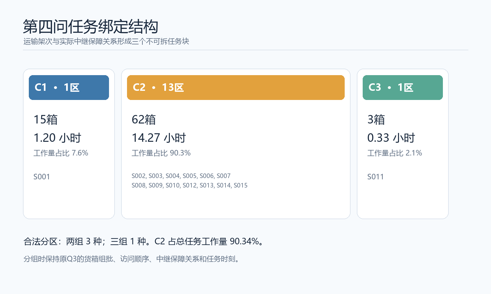
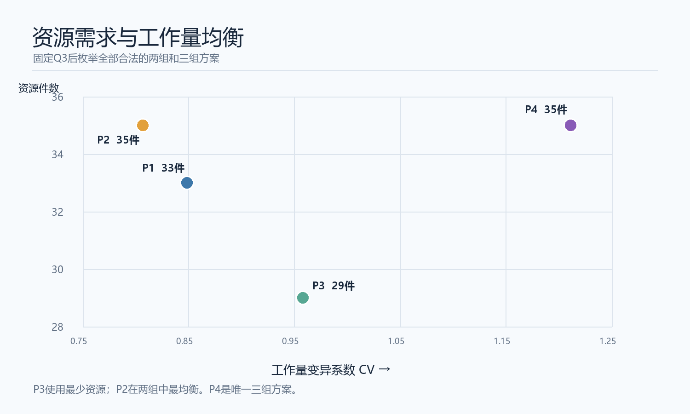
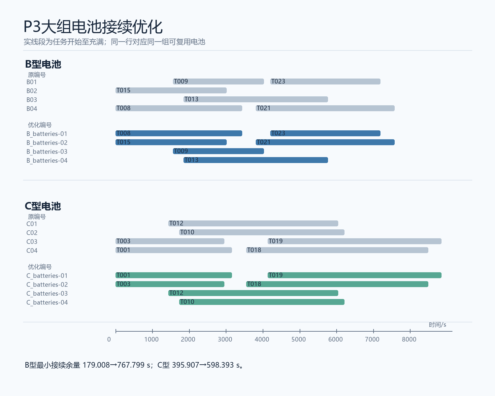
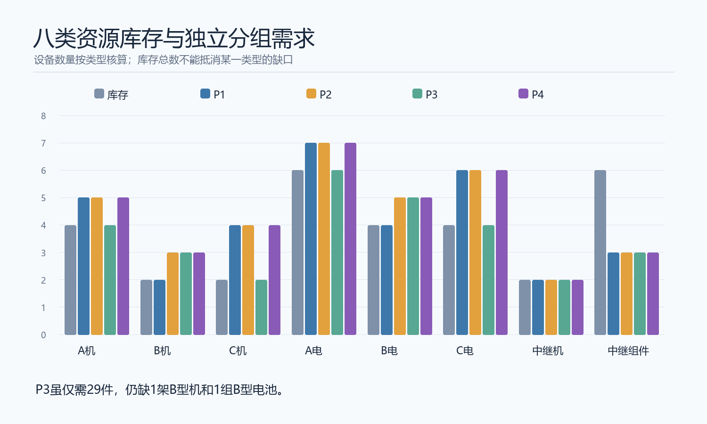

# 第四问交付说明：固定第三问后的精确分区与资源接续优化

输入：`D:/建模/shumo/results_q3_complete/q3_plan.json`；SHA256：`DF5DBF182CEA219A3EB173D86CE411ACD339AD7B9ED93BB1B4D0F5BC23F0F181`。
输入是已连续通信认证的第三问主方案；保持80箱、23架运输任务、3架中继任务、任务时刻和实际通信关系不变。
本次仅决定服务区分组，以及各组内部同类型机身、电池和能源组件的具体编号与接续。
资源可互换、初始满电、再次投入前充满，充电可并行；中继机占用计至300秒周转完成。

## 任务块与全部合法分区

运输架次连接其访问服务区；中继架次连接它实际保障的运输架次所访问服务区。
对这些超边取传递闭包，得到：

| 块 | 服务区 | 箱数 | 工作量/s |
|---|---|---:|---:|
| C1 | S001 | 15 | 4303.323232 |
| C2 | S002, S003, S004, S005, S006, S007, S008, S009, S010, S012, S013, S014, S015 | 62 | 51374.800317 |
| C3 | S011 | 3 | 1189.630286 |

工作量为运输和中继任务从准备开始至返航的时长之和，同一中继任务只计一次，不含充电时间。
组标签互换视为相同方案；3个任务块恰有3个两组方案和1个三组方案。

八维向量顺序：A/B/C运输机，A/B/C电池，中继机，中继能源组件。
库存为 (4,2,2,6,4,4,2,6)，统一执行最低需求为 (4,2,2,6,4,4,2,3)。

| 方案 | 分组 | 最低需求 | 合计 | 缺口 | 缺口合计 | 工作量CV | 库存足够 |
|---|---|---|---:|---|---:|---:|---|
| P1 | C1 / C2+C3 | (5,2,4,7,4,6,2,3) | 33 | (1,0,2,1,0,2,0,0) | 6 | 0.848655066 | 否 |
| P2 | C1+C3 / C2 | (5,3,4,7,5,6,2,3) | 35 | (1,1,2,1,1,2,0,0) | 8 | 0.806816582 | 否 |
| P3 | C1+C2 / C3 | (4,3,2,6,5,4,2,3) | 29 | (0,1,0,0,1,0,0,0) | 2 | 0.958161517 | 否 |
| P4 | C1 / C2 / C3 | (5,3,4,7,5,6,2,3) | 35 | (1,1,2,1,1,2,0,0) | 8 | 1.211169448 | 否 |

在两组方案中，以新增资源总件数最少作为明确政策，推荐P3。
P3缺1架B型运输机和1组B型电池；即使总需求29件小于库存总数30件，现有库存仍无法直接执行。
如B型资源难以采购，P1没有B型缺口，但总缺口增至6件；P2是两组中最均衡的方案。
P4是唯一合法三组方案，不能通过拆开C2来人为改善均衡。

P3各组具体工作量与配置：

| 组 | 任务块 | 服务区数 | 箱数 | 质量/kg | 运输/中继架次 | 工作量/s | 资源向量 |
|---|---|---:|---:|---:|---:|---:|---|
| G1 | C1+C2 | 14 | 77 | 733.000 | 22/3 | 55678.123550 | (4,2,2,6,4,4,2,3) |
| G2 | C3 | 1 | 3 | 25.000 | 1/0 | 1189.630286 | (0,1,0,0,1,0,0,0) |

## 最低配置及接续最优性

每组每类资源的最低数等于半开占用区间的最大同时占用数。
独立建立任务接续二分图：前任务释放不晚于后任务开始时才可连边；
最少接续链数为任务数减最大匹配数。全部组与八类资源的两种算法一致。
峰值时刻、同时占用任务、最大匹配大小和完整接续链见 `q4_optimality_certificate.json`；
具体实体编号、任务起止和接续余量见 `q4_resource_assignments.csv`。
各组箱数、质量、架次、能耗和八类占用率见 `q4_group_detail.csv`；占用率分母为该组首任务开始至全部资源最后释放的时长乘该类最低资源数。

固定最低件数后，对接续边的最小余量做阈值二分，每个阈值重新求最大匹配。
P3大组G1的关键电池结果：

| 电池 | 数量 | 原编号最小余量/s | 优化后最小余量/s | 改善/s | 下一阈值匹配数 |
|---|---:|---:|---:|---:|---:|
| B_batteries | 4 | 179.007999 | 767.799147 | 588.791148 | 1 |
| C_batteries | 4 | 395.907146 | 598.393369 | 202.486223 | 1 |

对应的优化接续链：

| 资源 | 任务链 | 接续余量/s |
|---|---|---|
| G1-B_batteries-01 | T008 → T023 | 767.799147 |
| G1-B_batteries-02 | T015 → T021 | 793.642499 |
| G1-B_batteries-03 | T009 | 不适用 |
| G1-B_batteries-04 | T013 | 不适用 |
| G1-C_batteries-01 | T001 → T019 | 979.907146 |
| G1-C_batteries-02 | T003 → T018 | 598.393369 |
| G1-C_batteries-03 | T012 | 不适用 |
| G1-C_batteries-04 | T010 | 不适用 |

电池接续余量的改善不代表全系统对延误已有同等缓冲：P3大组A型机的最小接续余量仍只有0.050585秒。

## 工作量下界与资源—均衡权衡

总工作量为56867.753835秒；最大任务块占比0.903408291。
以总体标准差定义工作量CV，K组的放松下界为(Kα−1)/√(K−1)。
两组下界0.806816582，由P2达到；三组下界1.209311605，唯一合法P4实际为1.211169448。

若限制两组工作量CV不超过给定阈值，同时使资源件数最少，则：

| CV上限范围 | 方案 | 最低资源件数 |
|---|---|---:|
| ε < 0.806816582 | 无合法方案 | — |
| 0.806816582 ≤ ε，ε < 0.848655066 | P2 | 35 |
| 0.848655066 ≤ ε，ε < 0.958161517 | P1 | 33 |
| 0.958161517 ≤ ε，无上限 | P3 | 29 |

资源件数是等权统计，不代表采购金额。若有实际价格，应使用八类缺口分别核算。
P3的新增成本为`B型机单价+B型电池单价`；P1为`A型机单价+2×C型机单价+A型电池单价+2×C型电池单价`。这给出两方案随采购价格切换的条件。
分组独立运行损失了不同时间段之间的设备复用机会；相对统一执行的27件，
P1/P2/P3/P4分别增加6/8/2/8件。

## 已保存Q3候选的后验比较

逐一按同样的第四问口径复算并回放已保存的11份Q3候选，详细目标与缺口见 `q4_q3_candidate_comparison.csv`。
所有候选均产生3个任务块；其中单独保存的`q4_compatible` 将两组最低缺口从P3的2件降至1件，三组缺口从P4的8件降至7件。
但其Q3最晚返航比当前主方案增加1490.312秒，总架次增加3，总能耗增加0.040364 kWh，加权交付时刻增加53864.504。
这些是更换Q3输入的后验实验结果，不能当作固定本次Q3后的第四问改进。

## 当前问题与后续改进

1. **库存不足。** P1/P2/P3/P4的逐类型缺口分别为6/8/2/8件，现有库存下四方案均不能直接执行。P3至少需补1架B型运输机和1组B型电池；补齐前不得把`executable_after_procurement=True`解释为库存可执行。
2. **任务块失衡。** C2占总工作量约90.34%；固定Q3下两组CV不可能低于0.806817，P3为0.958162。改变这一结构必须另行修改Q3任务和中继关系，并重新验证通信、能耗和时限。
3. **关键机身接续脆弱。** P3大组A型机的最小余量仅0.050585秒。电池余量改善只是局部改进；应对准备、飞行、返航和充电延误做扰动回放，评估增配或调整Q3任务时刻的代价。
4. **最优余量证书尚未独立复核。** 当前回放独立重算区间峰值并检查全部任务链，但未用第二套算法重算证书中的最大最小接续余量及下一阈值匹配数。改变这些证书字段而保持任务链不变，回放仍可返回PASS；因此`q4_validation.json`的PASS不能单独作为这些最优值的独立验收。
5. **实体资源映射未落地。** `G1-B_batteries-01`等是组内规划编号，尚未逐一对应现有U系列机身、电池和新增资源的实物编号。正式执行前应形成采购、配组和实物编号映射表并再次回放。
6. **推荐取决于采购政策。** P3按资源总件数最少推荐，尚无实际价格或供应约束。若B型资源昂贵或缺货，应依据上文价格条件比较P1等备选，不能把P3写成唯一经济最优。
7. **程序与输入边界。** `run_q4.py`锁定本文Q3输入SHA256，Q3更新后需重新生成四方案。完整结果经独立`run_q4.py`生成，原`run.py`仍输出旧Q4预览；当前执行入口还依赖`results_q3_complete/plans`目录提供11份候选对照。

## 回放与适用范围

独立回放状态：**PASS**；四方案资源分配记录共208行。回放逐任务检查一次分配、型号、区间不重叠、
电池或能源组件充满后复用、组间不共享、箱与任务守恒，以及实际通信关系。
`q4_validation.json` 保存逐方案结论。结构合法、回放通过、库存满足和补齐缺口后可执行分别记录。
结论只针对上述固定Q3输入与同类资源可互换的政策；没有改变第三问路线或声称Q3/Q4联合全局最优。

## 图表

运行：`python run_q4.py --plan results_q3_complete/q3_plan.json --output results_q4`。
